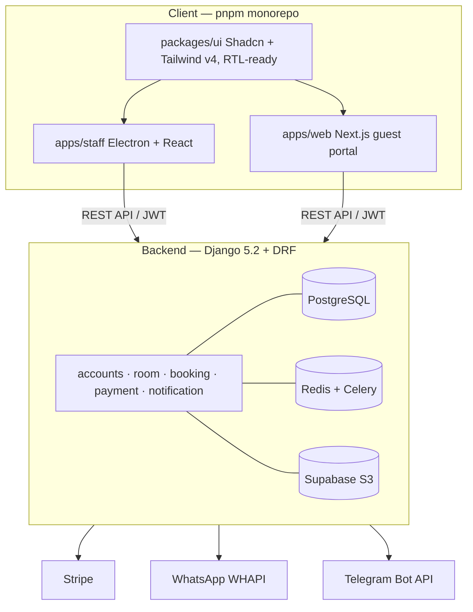

# Local Reservation System

A full-stack property booking platform built to replace the phone calls, WhatsApp messages, and handwritten notebooks that currently drive room reservations in local markets.

Managers get a **free desktop tool** for walk-in and phone bookings. Guests get a **clean web portal** to browse and book online. The platform earns a 10% commission only on bookings that originate from the web — the manager's tool is always free.

---

## Architecture



---

## Tech Stack

|Layer|Technology|
|---|---|
|Backend|Django 5.2 + DRF 3.16, PostgreSQL, Redis, Celery|
|Auth|SimpleJWT + Djoser, OTP via WhatsApp / Email / Telegram|
|Desktop|Electron 40 + Vite 7 + React 19 + TypeScript|
|Web|Next.js 16 + React 19 + TypeScript + Turbopack|
|Shared UI|Shadcn/ui + Tailwind v4, RTL-ready (Arabic/English)|
|Payments|Stripe Connect (pluggable adapter pattern)|
|Storage|Supabase S3 via django-storages|
|Notifications|WHAPI (WhatsApp), Telegram Bot API, Gmail SMTP|

---

## Key Technical Decisions

**Pluggable payment adapter.** `BasePaymentAdapter` defines the contract; `StripeAdapter` is the active implementation. Switching providers means activating a different `PaymentProvider` record — no code changes. Webhooks are idempotent via a unique constraint on `(provider, gateway_event_id)`.

**Dual booking flow.** Manager-initiated bookings (walk-in/phone) are auto-confirmed and free. Guest-initiated bookings go through the web portal, require payment, and carry a 10% platform commission. Both paths share the same booking lifecycle and notification system.

**Shared UI package.** Both apps (Electron + Next.js) consume a single `packages/ui` library with Shadcn components, Tailwind v4 tokens, and RTL support. One change propagates everywhere.

**Secure token handling in Electron.** Tokens are stored encrypted in the OS keychain via `safeStorage`. The renderer process holds tokens only in memory, never on disk.

**Monolith by design.** A Django monolith over microservices — reduces operational overhead for a solo-built system while keeping the codebase navigable. The modular app structure (`accounts`, `room`, `booking`, `payment`, `notification`) keeps concerns separated without distributed complexity.

**Field-level encryption.** Payment provider API keys and manager bank account numbers are encrypted at rest in the database using `django-encrypted-model-fields`.

---

## Feature Highlights

### Booking Lifecycle

```
PENDING → CONFIRMED → CHECKED_IN → COMPLETED
                                  ↘ CANCELLED (auto-refund if payment was completed)
```

Automated side effects at each transition: WhatsApp confirmations to guests, Telegram alerts to all staff, payout initiation on completion.

### Pricing Engine

Rules are evaluated in priority order — first match wins:

|Rule|Trigger|
|---|---|
|`seasonal`|Date range overlap|
|`weekend`|Specific days of the week|
|`length_of_stay`|Minimum nights discount|
|`holiday`|Public holiday rates|

### Authentication

Phone number as username (no email required). OTP delivered via guest's choice of WhatsApp, Email, or Telegram. 5-minute OTP TTL, rate-limited to 1 per 5 minutes. Proactive JWT refresh 60 seconds before expiry.

---

## Repository Structure

```
/
├── backend/
│   ├── config/               # Settings, URLs, Celery
│   └── api/
│       ├── accounts/         # Users, auth, OTP
│       ├── room/             # Listings, pricing, availability
│       ├── booking/          # Reservations, reviews
│       ├── notification/     # WhatsApp, Telegram, Email
│       ├── payment/          # Stripe, refunds, payouts
│       └── admin/audit/      # Audit log
├── client/
│   ├── apps/
│   │   ├── staff/            # Electron desktop app
│   │   └── web/              # Next.js guest portal
│   └── packages/
│       └── ui/               # Shared components
└── docs/
    ├── API_ENDPOINTS.md
    └── enhanced_erd.md
```

---

## Quick Start

### Backend

```bash
cd backend
python -m venv .venv && source .venv/bin/activate
pip install -r requirements.txt
cp .env.example .env
python manage.py migrate
python manage.py seed        # optional sample data
python manage.py runserver   # → http://localhost:8000
```

### Client

```bash
cd client
pnpm install
pnpm --filter staff dev      # Electron → :5173
pnpm --filter web dev        # Next.js  → :3000
```

Full setup guide, environment variables, and API reference in [`docs/`](https://claude.ai/chat/docs/).

---

## API Overview

All responses follow a standard envelope:

```json
{ "success": true, "message": "...", "data": { } }
```

|Prefix|Purpose|Auth|
|---|---|---|
|`/api/auth/`|Login, OTP, token refresh|Public|
|`/api/rooms/public/`|Browse available rooms|None|
|`/api/rooms/`|Room management|Manager|
|`/api/bookings/`|Create and manage bookings|Authenticated|
|`/api/payments/`|Payments, refunds, payouts|Authenticated / Admin|
|`/api/admin/audit/`|Audit log|Admin|

Full contract: [`docs/API_ENDPOINTS.md`](https://claude.ai/chat/docs/API_ENDPOINTS.md)

---

_This project is private. All rights reserved._